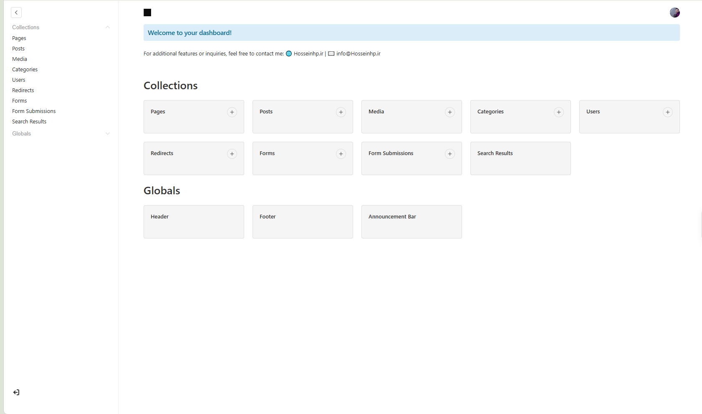
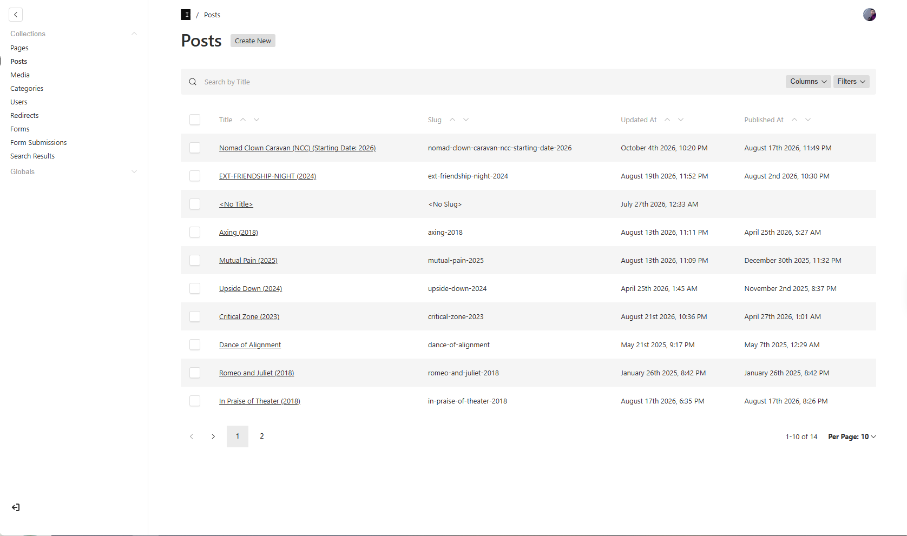
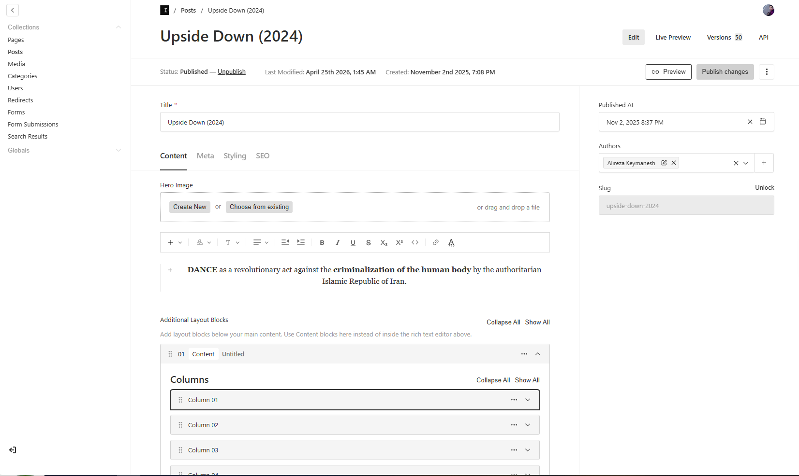
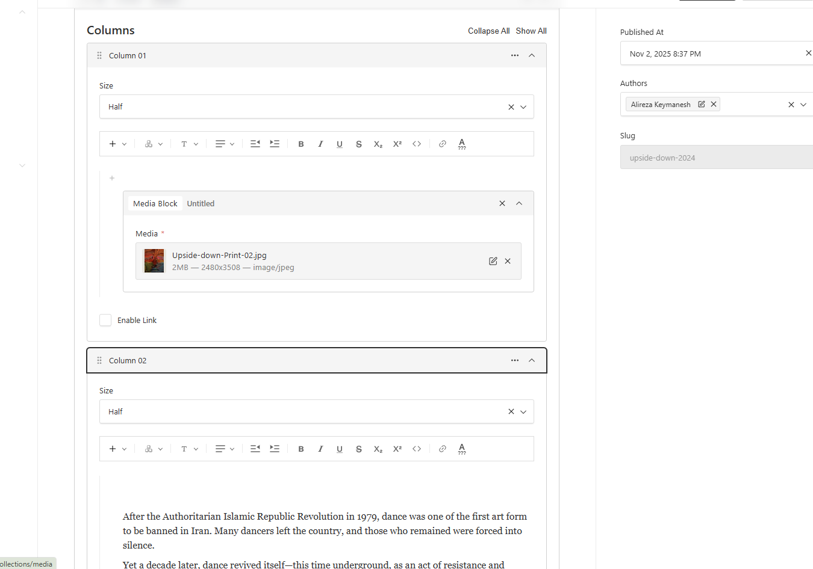
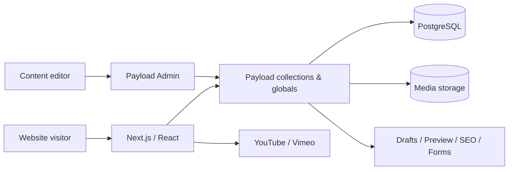

# Artist Portfolio CMS — Production Case Study

A public engineering case study for the production portfolio website **[alirezakeymanesh.com](https://alirezakeymanesh.com/)**.

> **This is intentionally not the production repository.** The live application's database, credentials, private drafts, deployment configuration, form submissions, and client-owned media are excluded. The code under `src-examples/` contains sanitized and lightly refactored excerpts from the production implementation so the engineering work can be reviewed without exposing the client system.

## Project context

The project started from the official **Payload Website Template** and was adapted into a client-specific portfolio and editorial platform. My work focused on the custom content model, reusable visual blocks, rich-text editing extensions, responsive media behavior, client-specific frontend experience, publishing workflow integration, and production customization around the Payload/Next.js stack.

This distinction matters: standard Payload features such as authentication, drafts, SEO/search/redirect plugins and the base admin application come from the framework/template; the strongest custom work in this case study is shown in the block system, editor extensions, responsive presentation components, styling behavior, and integrations.

## Tech stack

- Next.js 15 / App Router
- React 19
- TypeScript
- Payload CMS 3
- PostgreSQL
- Lexical rich-text editor
- Tailwind CSS
- Embla Carousel
- SendGrid integration

## Engineering highlights

- **Structured CMS layout system** with reusable content, portrait, fullscreen media, reel, media-slider and tab-oriented blocks.
- **Responsive editorial media** allowing separate desktop/mobile assets and support for uploaded media plus YouTube/Vimeo embeds.
- **Custom Lexical editor tooling** for text color, font family and font size controls inside the Payload editing experience.
- **Per-page and per-post presentation controls**, including CMS-managed colors and scroll-state visual transitions.
- **Production content workflows** integrating drafts, preview/live preview, versioning, SEO metadata, redirects, search, forms and cache revalidation.
- **Custom admin experience** with project branding and a simplified content workflow for a non-technical editor.

## CMS screenshots

### Admin dashboard



### Project / post management



### Post editor



### Flexible layout builder



## High-level architecture



## Selected code samples

The excerpts are deliberately small enough to review quickly. They are **not intended to form a runnable copy of the production application**.

| Sample | What it demonstrates |
| --- | --- |
| [`cms/contentBlock.config.ts`](src-examples/cms/contentBlock.config.ts) | Typed, reusable multi-column CMS block with nested rich-text/media capabilities |
| [`cms/reelBlock.config.ts`](src-examples/cms/reelBlock.config.ts) | Conditional Payload fields for desktop/mobile uploaded or external media |
| [`frontend/MediaCarousel.tsx`](src-examples/frontend/MediaCarousel.tsx) | Responsive uploaded-media / video carousel with URL normalization and accessible controls |
| [`frontend/PostThemeTransition.tsx`](src-examples/frontend/PostThemeTransition.tsx) | Client-side visual state driven by CMS-defined colors |
| [`editor/fontColorFeature.server.ts`](src-examples/editor/fontColorFeature.server.ts) | Server registration of a custom Payload Lexical feature |
| [`editor/fontColorFeature.client.tsx`](src-examples/editor/fontColorFeature.client.tsx) | Custom editor toolbar integration |
| [`integrations/newsletterHook.ts`](src-examples/integrations/newsletterHook.ts) | Sanitized form-submission integration pattern for a newsletter provider |

More implementation notes are in [`docs/ARCHITECTURE.md`](docs/ARCHITECTURE.md) and [`docs/CODE-SAMPLES.md`](docs/CODE-SAMPLES.md).

## Repository structure

```text
.
├── assets/                  # Sanitized admin screenshots
├── docs/                    # Architecture and implementation notes
├── src-examples/            # Sanitized/refactored production excerpts
├── .gitignore
├── SECURITY.md
├── THIRD_PARTY_NOTICES.md
└── README.md
```

## Privacy and ownership

This repository is a portfolio artifact, not a source mirror. It intentionally excludes:

- environment files and API keys
- database backups and authentication data
- form submissions and subscriber information
- production deployment configuration
- private drafts and unpublished content
- original high-resolution client media

Website text, photography, video and other client content remain the property of their respective owners.

## Attribution

The production project was built on the official Payload Website Template. Payload and its template provide the core CMS/framework foundation; this repository focuses on the client-specific customization work. See [`THIRD_PARTY_NOTICES.md`](THIRD_PARTY_NOTICES.md).

## Developer

**Hossein Hosseinpour**  
Portfolio: [hosseinhp.ir](https://hosseinhp.ir/)
