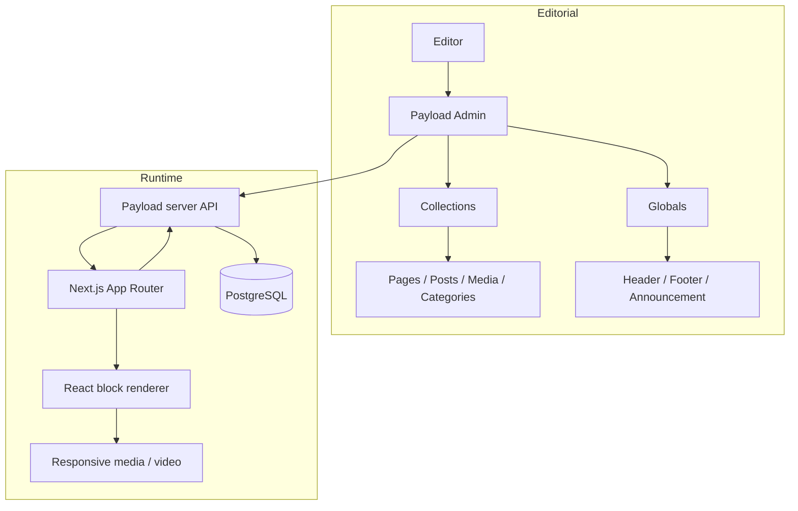

# Architecture

## Overview

The production site combines a Next.js App Router frontend with Payload CMS in the same application. Payload provides the editorial/admin layer and typed content API; React components render the structured content on the public site.

## Content model

The production application uses Pages and Posts for primary content, Media for uploads, Categories for taxonomy, and Payload globals for shared UI. Client-specific blocks extend the template's basic block builder with richer presentation components such as responsive portrait sections, fullscreen media, reel layouts, mixed media carousels and tabbed content.

## Rendering model

Payload stores structured block data. A central block renderer maps each `blockType` to a React component. This keeps the frontend component-driven while allowing the editor to assemble pages without modifying source code.

## Responsive media

Several custom blocks allow a separate mobile and desktop media selection. The production implementation also supports external video providers for reel and carousel content. The public samples simplify this logic while preserving the engineering pattern.

## Editor customization

The standard Lexical toolbar was extended with custom font controls. The server feature registers the custom editor capability with Payload, while the client feature injects the toolbar UI and applies styles to the current Lexical selection.

## Publishing workflow

Pages and Posts use draft/version workflows and preview URLs. Revalidation hooks refresh affected frontend routes after relevant CMS changes. Payload plugins are also used for SEO, redirects, forms, nested categories and search.
